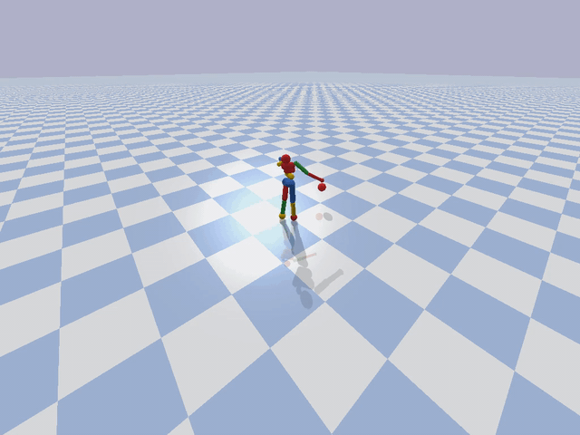

# Goal-conditioned Batch Reinforcement Learning for Rotation-Invariant Locomotion

This README contains all the details required to run the code to reproduce
the results of the paper `Goal-conditioned Batch Reinforcement Learning for
Rotation Invariant Locomotion`.

### Dependencies
- Python 3.5+
- Pytorch (>= 0.4.0 with CUDA version >= 9.0)
- Tensorflow (>= 1.14)
- NumPy
- OpenAI Gym
- MuJoCo
- Pybullet

The standard RL and goal-conditioned RL baselines use existing code
from [OpenAI baselines](https://github.com/openai/baselines) and [stable-baselines](https://github.com/hill-a/stable-baselines). The standard RL baseline for
the Ant is trained using the Proximal Policy Optimization (PPO) code from
`baselines`. For the Humanoid and Minitaur, the standard RL baselines are
trained using the Soft Actor-Critic (SAC) code from `stable-baselines` with
default hyperparameters.

### Environments
- Ant - [OpenAI Gym](https://gym.openai.com/) [Mujoco](http://www.mujoco.org/)
- Humanoid - [Pybullet](https://github.com/bulletphysics/bullet3/tree/master/examples/pybullet)
- Minitaur - [Pybullet](https://github.com/bulletphysics/bullet3/tree/master/examples/pybullet)

### How to run the code?

The scripts for the goal-conditioned batch RL methods discussed in the paper
are in the directory `scripts/`. The modified environments to convert
the locomotion task to goal-directed locomotion are present in `modified_envs/`.
Pretrained models of all methods (including standard RL and goal-conditioned
RL baselines) can be downloaded [here](https://drive.google.com/drive/folders/1sHq7gUf4AeUy80D1883l1iZgtTgpn_dH?usp=sharing).
The data used to train all baselines can be downloaded [here](https://drive.google.com/open?id=1VJwfyC6JmkgEyKL8tbFQ9niaV0n7ZY4j).

In order to train/test any of the goal-conditioned batch RL methods (using
either equivalence or the naive goal-conditioned policy), use the following
command:

```
python main.py

  -e env-name
  --resume path-to-checkpoint-file (only if you want to evaluate or resume training)
  -s random-seed
  --no-gpu (to train using CPU)

  # Training
  -i path-to-data-file
  --dir-name save-path (path to save checkpoints, optional)
  --log-perf-file log (path to log file to record losses/metrics)
  --n-epochs ne (number of training epochs)
  --learning-rate lr
  --batch-size b
  --exp-name ex (to organize models and results)
  --start-index st (optionally start training from index != 0)
  --n-training-samples n-tr
  -k embedding-dim (dimension of the embeddings produced by the encoder - used
    only in this approach)

  # Testing
  --test-only (evaluate an existing model)
  --visualize (render episodes)
  --n-test-steps n (number of test episodes during model evaluation)
  --min-distance min (minimum distance from agent that goal should lie)
  --max-distance max (maximum distance from agent that goal should lie)
  --y-range y (deviation of goal position from agent's initial direction)
  --threshold th (Distance between agent and goal at which the agent is
    considered successful at reaching the goal)
```

For instance, to train an Ant for 2M timesteps using the data file
`ant-on-policy-samples` with learning rate 0.001 and batch size 512, do
the following:

```
cd scripts/naive-gcp/

python main.py -e Ant-v2 -i ant-on-policy-samples --learning-rate 0.001 --batch-size 512
```

If not specified, the other hyperparameters will assume default values.

### Results

The `performance.py` script in the `scripts/` directory measures the
performance of the goal-conditioned batch RL methods. This script computes the
performance metric: the closest distance to the goal that the agent is able to
achieve, for 1000 episodes spread uniformly over 10 random seeds. In order to
ensure fair comparison, the random seeds are maintained across all methods. The
details of goal generation are provided in the Appendix.

Both quantitative and qualitative results are reported in the paper. Furthermore,
qualitative results of comparisons between this approach and the best standard RL
baseline, in the form of videos, can be found [here](https://drive.google.com/drive/folders/1q1Hi5n7f866-a_LMlsaWnNbjFaF28-4i?usp=sharing). Note that the Humanoid
trained using this approach walks much faster towards the goals, and in a much
better manner than the one trained using standard RL techniques, even though
both agents ultimately reach the goals in the example provided.

The following gifs show qualitative examples of this approach in the Ant and Humanoid environments:

 


### Citing this work

If you use this work, please consider citing the following paper:
```
@misc{mavalankar2020goalconditioned,
    title={Goal-conditioned Batch Reinforcement Learning for Rotation Invariant Locomotion},
    author={Aditi Mavalankar},
    year={2020},
    eprint={2004.08356},
    archivePrefix={arXiv},
    primaryClass={cs.LG}
}
```
